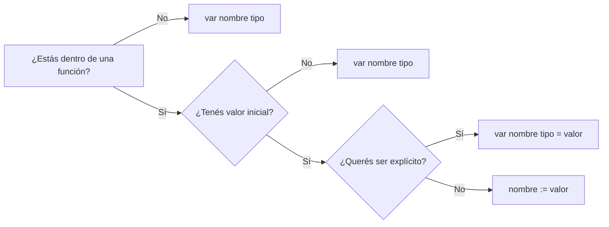

# Go — Clase 1: Fundamentos del lenguaje
`Seminario de Lenguajes opción Go | Raúl Champredonde`

---

## Contexto de Conexión

> 📌 Tema inicial de la materia. No hay hilo previo.

Go es un lenguaje compilado con sintaxis tipo C, así que si venís de Java, JavaScript o C, la lectura del código va a ser natural desde el primer día. Lo que cambia es cómo Go piensa el tipado, los paquetes y la declaración de variables.

---

## Conceptos Core

- **Package**: unidad de organización del código. Todo programa ejecutable pertenece al package `main`.
- **Identificador exportado**: cualquier nombre que empieza con **mayúscula** es visible desde afuera del package (`Println`, `Pi`). Los que empiezan en minúscula son privados.
- **Inferencia de tipos**: Go puede deducir el tipo de una variable a partir del valor que se le asigna — no siempre hace falta declararlo explícitamente.
- **Short assignment (`:=`)**: declara **y** asigna en una sola línea. Solo usable dentro de funciones.
- **Named type**: un tipo con nombre propio basado en otro tipo existente. Permite que el compilador detecte mezclas accidentales de tipos.
- **Valor por defecto (zero value)**: toda variable declarada sin inicialización tiene un valor por defecto: `0` para numéricos, `false` para bool, `""` para string.

---

## Desarrollo

### ¿Qué es Go?

Go (o Golang) es un lenguaje compilado, fuertemente tipado, con sintaxis inspirada en C. Fue desarrollado por Google en 2007. Es multiplataforma y de código abierto.

Se usa principalmente para: desarrollo web del lado del servidor, aplicaciones de red, desarrollo nativo de la nube y aplicaciones concurrentes. Su principal atractivo es la combinación de velocidad de compilación/ejecución, soporte nativo de concurrencia y sintaxis simple.

---

### Estructura de un programa

```go
package main

import ("fmt")

func main() {
    fmt.Println("Hello World!")
}
```

Cuatro elementos obligatorios en orden:

1. **`package main`** — declara a qué package pertenece el archivo
2. **`import`** — importa los packages necesarios (puede ser uno o varios)
3. **`func main()`** — punto de entrada del programa
4. **Sentencias** — el código que se ejecuta

> ⚠️ La llave `{` de apertura de una función **nunca** puede ir al inicio de una línea nueva — va en la misma línea que el `func`.

Separación de sentencias: por salto de línea (`Enter`) o por `;`. Las líneas en blanco se ignoran.

Comentarios: `// una línea` o `/* varias líneas */`.

---

### Variables

```go
// Forma larga
var i int
var i int = 1
var i, j int = 1, 2

// Con inferencia de tipo
var c, d, e = true, false, "Texto"

// Short assignment (solo dentro de funciones)
k := 3
```

También se puede declarar en bloque:

```go
var (
    i int
    c, d, e bool
)
```

Reglas para nombres de variables: case-sensitive, pueden tener letras, dígitos y `_`, no pueden empezar con `_`, no pueden ser una palabra reservada.

`:=` **no puede usarse a nivel de package** — solo dentro de funciones, porque en el package toda sentencia debe empezar con una palabra clave (`var`, `func`, etc.).

---

### Constantes

```go
const Pi = 3.14         // sin tipo explícito
const A int = 1         // con tipo

const (
    A int = 1
    B     = 3.14
)
```

No se puede declarar constantes con `:=`.

---

### Tipos básicos

| Categoría | Tipos | Zero value |
|---|---|---|
| Booleano | `bool` | `false` |
| Texto | `string` | `""` |
| Entero | `int`, `int8`, `int16`, `int32`, `int64` | `0` |
| Entero sin signo | `uint`, `uint8` ... `uint64`, `uintptr` | `0` |
| Alias | `byte` (= uint8), `rune` (= int32) | `0` |
| Float | `float32`, `float64` | `0` |
| Complejo | `complex64`, `complex128` | `(0+0i)` |

> Regla práctica: usar siempre `int` para enteros, salvo que haya una razón específica para usar otro tamaño.

---

### Conversión de tipos

Go **no hace conversiones implícitas** entre tipos numéricos. Hay que hacerlas explícitamente con la sintaxis `T(v)`:

```go
var i int = 42
var f float64 = float64(i) + 0.000001   // int → float64
var u uint = uint(f)                     // float64 → uint
```

Solo se puede convertir entre tipos que tengan el mismo tipo subyacente.

---

### Named types

Permiten crear tipos con nombre para evitar mezclas accidentales:

```go
type Celsius float64
type Fahrenheit float64

func CToF(c Celsius) Fahrenheit {
    return Fahrenheit(c * 9 / 5 + 32)
}
```

Aunque `Celsius` y `Fahrenheit` son ambos `float64` por debajo, el compilador no permite sumarlos directamente. Hay que convertir explícitamente. Esto es útil para modelar unidades, identificadores, etc.

---

### Operadores

#### Aritméticos (sobre numéricos, mismo tipo)

| Op | Descripción |
|---|---|
| `+`, `-`, `*`, `/`, `%` | suma, resta, multiplicación, división, módulo |
| `-x`, `+x` | menos/más unario |

#### Sobre strings
| Op | Descripción |
|---|---|
| `+` | concatenación |

#### Comparación (mismo tipo, resultado `bool`)
`==`, `!=`, `>`, `<`, `>=`, `<=`

#### Lógicos (sobre `bool`)
`&&` (and), `||` (or), `!` (not) — con **short-circuit**: si el primer operando ya determina el resultado, el segundo no se evalúa.

#### Bitwise (sobre numéricos)
`&`, `|`, `^`, `<<`, `>>`

---

### Asignación

La asignación es una **instrucción**, no un operador (no se puede usar dentro de expresiones como en C).

```go
x = expresión    // asignación simple
x += 3           // equivale a x = x + 3
x++              // incremento (instrucción, no expresión)
x--              // decremento
```

Tabla de asignaciones compuestas: `+=`, `-=`, `*=`, `/=`, `%=`, `&=`, `|=`, `^=`, `>>=`, `<<=`.

> `x++` y `x--` son **instrucciones** en Go, no operadores. No se puede hacer `y = x++` como en C.

---

## Visualización

### Declaración de variables: las tres formas



---

## Lo que no podés ignorar

> 1. **`:=` solo dentro de funciones** — a nivel de package, obligatorio usar `var`.
> 2. **No hay conversiones implícitas de tipos** — siempre `T(v)` explícito.
> 3. **Exportado = empieza con mayúscula** — `Println` es público, `println` sería privado.
> 4. **La llave `{` va en la misma línea** — ponerla sola en la siguiente es error de compilación.
> 5. **`x++` es una instrucción, no una expresión** — no se puede usar en medio de una expresión como en C.
