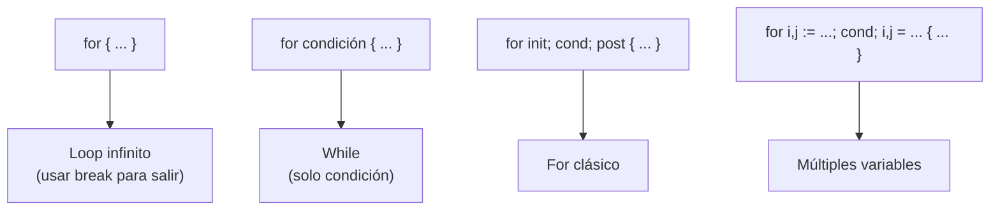

# Go — Clase 2: Estructuras de control, funciones y package fmt
`Seminario de Lenguajes opción Go | Raúl Champredonde`

---

## Contexto de Conexión

Clase 1 cubrió los bloques de construcción del lenguaje: tipos, variables, constantes y operadores. Ahora con eso en mano, podemos armar lógica real: flujo de control con `for`, `if` y `switch`; funciones con retorno múltiple; y el package `fmt` para entrada/salida formateada.

---

## Conceptos Core

- **`for`**: la única estructura de iteración en Go. Reemplaza a `while`, `do-while` y `for` clásico.
- **`if` con inicialización**: permite declarar una variable local que solo vive dentro del bloque `if/else`.
- **`switch` sin selector**: equivale a una cadena de `if/else if`, pero más legible.
- **Retorno múltiple**: una función puede devolver más de un valor. Es el mecanismo estándar de Go para devolver resultado + error.
- **Named return**: los valores de retorno pueden tener nombre, y un `return` vacío devuelve los valores actuales de esas variables.
- **Verbos de formato (`%v`, `%d`, `%s`, etc.)**: marcas que usa `fmt.Printf` para formatear la salida.

---

## Desarrollo

### Estructuras de control

#### Secuencia

```go
x := 5
fmt.Println(x)
x++
fmt.Println(x)
```

Las sentencias se ejecutan de arriba hacia abajo. Pueden separarse con `Enter` o `;`.

---

#### Iteración — `for`

Go tiene **un solo tipo de loop**: `for`. Con él se implementan todos los patrones:

```go
// Loop infinito (equivalente a while(true))
for {
    // ...
}

// While (solo condición)
sum := 1
for sum < 1000 {
    sum += sum
}

// For clásico (init; condición; post)
for i := 0; i < 10; i++ {
    sum += i
}

// Múltiples variables en init y post
for i, j := 0, 10; i <= j; i, j = i+1, j-1 {
    fmt.Println(i, "-", j)
}
```

Partes opcionales del `for` clásico — cualquiera puede omitirse:

```go
for ; sum < 1000; {   // sin init ni post = while
    sum += sum
}
```

**Do-while** (ejecutar al menos una vez):

```go
i := 0
for {
    i++
    if i >= 10 {
        break
    }
}
```

---

#### Selección — `if`

```go
// Simple
if x > y {
    fmt.Println(x)
}

// Con else
if x < y {
    fmt.Println(x)
} else {
    fmt.Println(y)
}

// Con else if
if x > y && x > z {
    fmt.Println("x")
} else if y > x && y > z {
    fmt.Println("y")
} else {
    fmt.Println("z")
}
```

**`if` con sentencia de inicialización** — la variable declarada solo existe dentro del bloque:

```go
if v := math.Pow(x, n); v < lim {
    fmt.Println(v)
} else {
    fmt.Println(lim)
}
// v no existe acá afuera
```

> Intentar usar `v` fuera del bloque es error de compilación.

---

#### Selección — `switch`

```go
// Con selector
switch runtime.GOOS {
case "darwin":
    fmt.Println("OS X.")
case "linux":
    fmt.Println("Linux.")
default:
    fmt.Println("Other")
}

// Con inicialización + selector
switch os := runtime.GOOS; os {
case "darwin":
    fmt.Println("OS X.")
// ...
}

// Sin selector (equivale a if/else if encadenado)
switch {
case t.Hour() < 12:
    fmt.Println("Good morning!")
case t.Hour() < 17:
    fmt.Println("Good afternoon.")
default:
    fmt.Println("Good evening.")
}
```

En Go, el `switch` **no necesita `break`** — cada case termina solo. Si querés caer al siguiente, usás `fallthrough`.

---

### Funciones

```go
// Sin retorno
func saludar() {
    fmt.Println("Hola")
}

// Con parámetros
func add(x int, y int) {
    fmt.Println(x + y)
}

// Parámetros del mismo tipo: se puede abreviar
func add(x, y int) {
    fmt.Println(x + y)
}
```

**Con retorno:**

```go
func add(x, y int) int {
    return x + y
}
```

**Retorno múltiple** — Go permite devolver más de un valor:

```go
func swap(x int, y int) (int, int) {
    return y, x
}

a, b = swap(a, b)
```

**Named return** — los valores de retorno tienen nombre y un `return` vacío los devuelve:

```go
func swap(x1 int, y1 int) (x2, y2 int) {
    x2, y2 = y1, x1
    return   // devuelve x2 e y2
}
```

> El retorno múltiple es el patrón estándar de Go para `(resultado, error)`. Lo vas a ver constantemente.

---

### Package `fmt`

#### Salida a pantalla

| Función | Comportamiento |
|---|---|
| `fmt.Print(...)` | Imprime los argumentos. Agrega espacio entre ellos salvo que alguno sea string. |
| `fmt.Println(...)` | Igual pero **siempre** agrega espacio entre argumentos y `\n` al final. |
| `fmt.Printf(format, ...)` | Formatea según verbos (`%d`, `%s`, etc.) y luego imprime. |

```go
const name, age = "Kim", 22
fmt.Print(name, " is ", age, " years old.\n")  // Kim is 22 years old.
fmt.Println(name, "is", age, "years old.")     // Kim is 22 years old.
fmt.Printf("%s is %d years old.\n", name, age) // Kim is 22 years old.
```

#### Verbos de formato principales

**Generales:**

| Verbo | Descripción | Ejemplo |
|---|---|---|
| `%v` | Formato por defecto según tipo | `42 Pepe` |
| `%#v` | Sintaxis Go del valor | `42 "Pepe"` |
| `%T` | Tipo del valor | `int string` |
| `%%` | Literal `%` | `%` |
| `\n` | Salto de línea | |
| `\t` | Tabulación | |

**Enteros:**

| Verbo | Descripción |
|---|---|
| `%d` | Decimal |
| `%b` | Binario |
| `%x` / `%X` | Hexadecimal minúscula / mayúscula |
| `%o` / `%O` | Octal / Octal con prefijo `0o` |
| `%c` | Carácter Unicode |
| `%U` | Formato Unicode (`U+1F642`) |

**Strings:**

| Verbo | Descripción |
|---|---|
| `%s` | Valor normal |
| `%q` | Con comillas dobles |
| `%x` / `%X` | Base 16 |

**Floats:**

| Verbo | Descripción |
|---|---|
| `%f` / `%F` | Con decimales, sin exponente |
| `%e` / `%E` | Notación científica |
| `%g` / `%G` | `%e` para exponentes grandes, `%f` en el resto |

**Equivalencias de `%v`:**

| Tipo | Equivale a |
|---|---|
| `bool` | `%t` |
| `int` | `%d` |
| `float32` | `%g` |
| `string` | `%s` |

#### Width y precision

```go
i := 123
f := 123.12

fmt.Printf("%d\n", i)      // 123
fmt.Printf("%6d\n", i)     //    123   (ancho mínimo 6)
fmt.Printf("%06d\n", i)    // 000123   (relleno con ceros)
fmt.Printf("%+d\n", i)     // +123     (mostrar signo)

fmt.Printf("%f\n", f)      // 123.120000
fmt.Printf("%8.2f\n", f)   //   123.12  (ancho 8, 2 decimales)
fmt.Printf("%08.2f\n", f)  // 00123.12  (relleno con ceros)
```

Flags a investigar: `-` (alineación izquierda), `#`, ` ` (espacio), `%.2f`, `%9.f`.

#### Generar string sin imprimir (`Sprintf`, `Sprint`, `Sprintln`)

```go
s := fmt.Sprintf("%s is %d years old.\n", name, age)
s := fmt.Sprint(name, " is ", age, " years old.\n")
s := fmt.Sprintln(name, "is", age, "years old.")
// Resultado: "Kim is 22 years old."
```

#### Entrada de datos (`Scan`, `Scanf`, `Scanln`)

```go
// Scan: lee palabras separadas por espacio o newline
var mensaje string
n, e := fmt.Scan(&mensaje)

// Scanf: lee con formato específico
var nom, ape string
var tel int
n, e := fmt.Scanf("%s %s %d", &nom, &ape, &tel)

// Scanln: lee hasta el newline
var nom, ape string
n, e := fmt.Scanln(&nom, &ape)
```

> El `&` es necesario para pasar la **dirección** de la variable — así `Scan` puede modificarla. (El operador `&` se verá en detalle cuando se vean punteros.)

#### Scan desde string (`Sscan`, `Sscanf`, `Sscanln`)

Igual que `Scan` pero leen desde un string en vez de stdin:

```go
var x, y string
fmt.Sscan("100 200", &x, &y)         // x="100", y="200"
fmt.Sscanf("500 600", "%s %s", &x, &y)
fmt.Sscanln("900 1000\n", &x, &y)    // x="900", y="1000"
```

Diferencia clave entre `Sscan` y `Sscanln`: `Sscanln` se detiene en el primer `\n` aunque haya más valores disponibles.

---

## Visualización

### El único `for` de Go, todos sus modos



---

## Lo que no podés ignorar

> 1. **`for` es el único loop** — `while` y `do-while` no existen; se simulan con `for`.
> 2. **`switch` no necesita `break`** — cada `case` termina solo. Si no ponés `break` en C se cae al siguiente; en Go no.
> 3. **Variable del `if` con inicialización no existe afuera** — su scope termina con el bloque `if/else`.
> 4. **Retorno múltiple es idiomático en Go** — el patrón `(resultado, error)` es la forma estándar de manejar errores.
> 5. **`&variable` en `Scan`** — sin el `&` se pasa una copia y el valor leído se pierde. Siempre con `&`.
