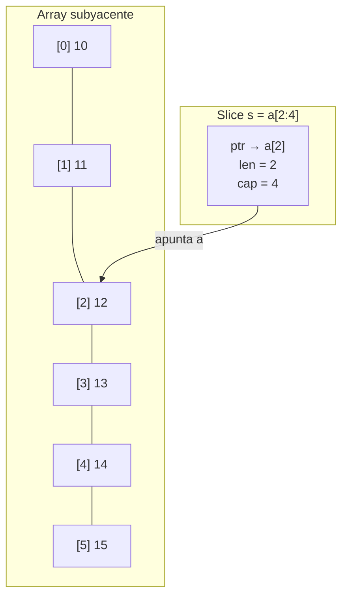
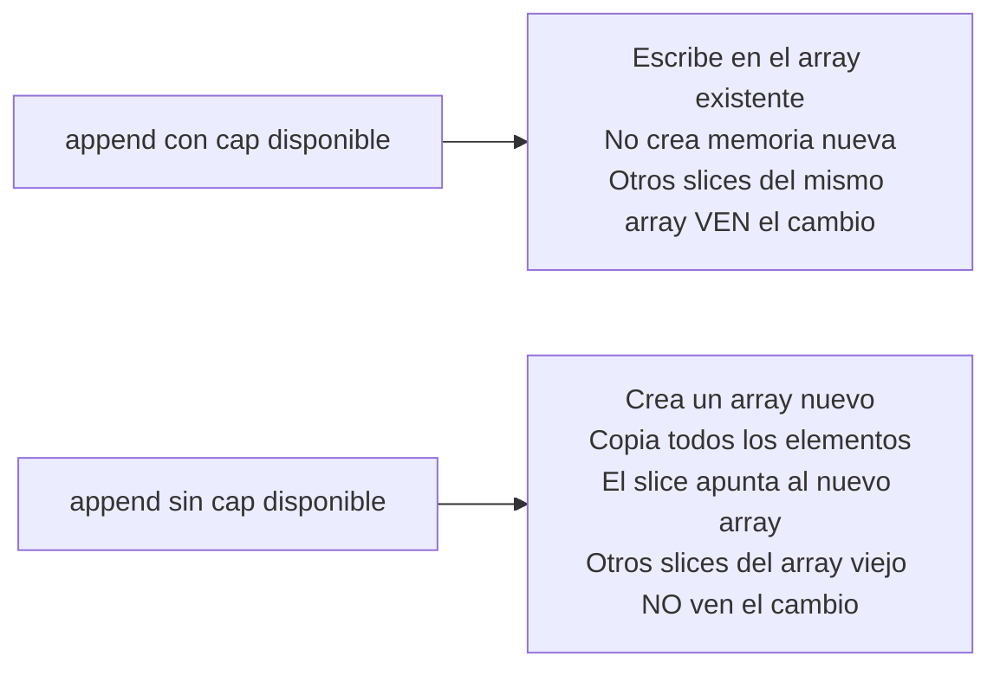

# Go — Clase 3: Arrays, Slices, For Range y Maps
`Seminario de Lenguajes opción Go | Raúl Champredonde`

---

## Contexto de Conexión

Clase 2 cubrió estructuras de control (`for`, `if`, `switch`) y funciones. Ahora con eso en mano, la clase 3 introduce las **colecciones** del lenguaje: cómo agrupar múltiples valores. El tema central es la diferencia entre arrays (tamaño fijo) y slices (tamaño dinámico), que es una de las cosas más características de Go.

---

## Conceptos Core

- **Array**: secuencia de longitud **fija** de elementos del mismo tipo. El tamaño es parte del tipo.
- **Slice**: "ventana" sobre un array subyacente. Longitud **variable**. La estructura de datos más usada en Go.
- **`len(s)`**: longitud actual del slice (cuántos elementos tiene).
- **`cap(s)`**: capacidad — cuántos elementos caben desde el inicio del slice hasta el final del array subyacente.
- **`nil` slice**: slice declarado pero no inicializado. `len` y `cap` son 0. No se puede escribir en él.
- **`append`**: agrega elementos a un slice. Si la capacidad se agota, Go crea un array nuevo más grande automáticamente.
- **`copy`**: copia elementos entre slices. El slice destino es **independiente** del source.
- **Map**: colección no ordenada de pares clave-valor. Similar a un diccionario o tabla hash.
- **`for range`**: itera sobre arrays, slices o maps devolviendo índice/clave y valor en cada vuelta.

---

## Desarrollo

### Arrays

Secuencia indexada, longitud fija, primer índice en 0. **La longitud es parte del tipo**: `[5]int` y `[3]int` son tipos distintos.

```go
// Declaración y asignación
var x [5]int
x[4] = 100
fmt.Println(x)  // [0 0 0 0 100]

// Inicialización directa
x := [5]float64{98, 93, 77, 82, 83}

// Con tamaño inferido por el compilador
x := [...]float64{98, 93, 77, 82, 83}

// Inicialización nombrada (por índice)
arr := [5]int{1: 10, 2: 20, 3: 30}
fmt.Println(arr)  // [0 10 20 30 0]

// Longitud
fmt.Println(len(arr))  // 5
```

**Arrays multidimensionales:**

```go
a := [2][2]string{
    {"Hello", "World"},
    {"Hola",  "Mundo"},
}
fmt.Println(a[0], a[1])  // [Hello World] [Hola Mundo]
```

> ⚠️ Los arrays en Go se pasan **por copia** a las funciones — si pasás un `[600]int`, se copian los 600 enteros. Para evitar esto se usan slices o punteros.

---

### Slices

La longitud fija de los arrays los hace incómodos en la práctica. Los **slices** son la solución: tienen longitud variable y son la estructura más usada en Go.

Un slice **siempre apoya sobre un array subyacente**. No es un array en sí — es una referencia a un segmento de uno.

#### Las 3 formas de crear un slice

```go
// 1. Slicear un array existente
a := [6]int{10, 11, 12, 13, 14, 15}
s := a[2:4]          // len=2, cap=4  → elementos: [12, 13]

// 2. Literal de slice
var s1 []int         // nil slice: len=0, cap=0
s2 := []int{}        // slice vacío: len=0, cap=0
s3 := []int{1, 2, 3} // len=3, cap=3

// 3. Con make
s1 := make([]int, 5, 10)  // len=5, cap=10
s2 := make([]int, 5)      // len=5, cap=5
```

#### `len` vs `cap`

- **`len`**: cuántos elementos tiene el slice ahora.
- **`cap`**: cuántos elementos caben desde el inicio del slice hasta el final del array subyacente.

```go
s := []int{1, 2, 3, 4, 5, 6}
// len=6, cap=6

t := s[1:4]
// t = [2 3 4], len=3, cap=5  (desde índice 1 hasta el final del array)
```

#### Slice nil

```go
var s []int
fmt.Println(s, len(s), cap(s))  // [] 0 0
if s == nil {
    fmt.Println("nil!")          // nil!
}
```

Un `nil` slice se comporta como un slice vacío para `len`, `cap` y `range`, pero **no se puede escribir en él directamente**.

---

#### Slices son referencias

Modificar un slice modifica el array subyacente, y cualquier otro slice que apunte al mismo array ve el cambio:

```go
a := [6]int{10, 11, 12, 13, 14, 15}
s := a[2:4]         // s apunta a a[2] y a[3]

s[1] = 31           // modifica a[3]
a[2] = 21           // modifica a[2]

fmt.Println(a, s)   // [10 11 21 31 14 15]   [21 31]
```

> Esta es la diferencia clave con `copy`: un slice es una **vista** del array original, no una copia.

---

#### `append` — agregar elementos

```go
func append(slice []Type, elems ...Type) []Type
```

```go
var s []int
s = append(s, 0)        // [0]        len=1, cap=1
s = append(s, 1)        // [0 1]      len=2, cap=2
s = append(s, 2, 3, 4)  // [0 1 2 3 4] len=5, cap=6

// Concatenar dos slices
s = append(s, s...)     // [0 1 2 3 4 0 1 2 3 4] len=10, cap=12
```

Cuando `append` supera la capacidad del array subyacente, Go crea automáticamente un array nuevo (con el doble de capacidad aprox.) y copia todo. Después de esto el slice ya no comparte memoria con el array original.

---

#### `copy` — copia independiente

```go
numbers := []int{1, 2, 3, 4, 5, 6, 7, 8, 9, 10, ...20 elementos}
neededNumbers := numbers[:5]        // referencia, cap=20
numbersCopy := make([]int, len(neededNumbers))
copy(numbersCopy, neededNumbers)    // copia real, cap=5

numbers[2] = 100                    // modifica el array subyacente
fmt.Println(neededNumbers)          // [1 2 100 4 5] — ve el cambio
fmt.Println(numbersCopy)            // [1 2 3 4 5]   — no ve el cambio
```

`copy` crea una copia **independiente** — no comparte memoria con el original.

---

#### Slices multidimensionales

```go
tablero := [][]string{
    {"_", "_", "_"},
    {"_", "_", "_"},
    {"_", "_", "_"},
}
```

Slice de slices: cada fila puede tener distinto largo (a diferencia de un array 2D).

---

### Parámetros: arrays se copian, slices son referencias

```go
type Array600Int [600]int

func sumPrimes(arr Array600Int) int {
    arr[0] = 17          // modifica la COPIA local
    // ...
}

primes := Array600Int{0: 2, 1: 3, 2: 5, ...}
sumPrimes(primes)
fmt.Println(primes[0])  // sigue siendo 2 — la copia no afectó al original
```

Los **slices**, en cambio, son referencias: si pasás un slice a una función y esa función modifica sus elementos, el cambio se ve afuera.

---

### For Range

`for range` itera sobre arrays, slices y maps. Devuelve índice (o clave) y valor en cada iteración:

```go
arr := [10]int{9, 8, 7, 6, 5, 4, 3, 2, 1, 0}

// Índice y valor
for index, elem := range arr {
    fmt.Printf("%d:%d - ", index, elem)
}

// Solo valor (ignorar índice con _)
for _, elem := range arr {
    fmt.Printf("%d - ", elem)
}

// Solo índice (para modificar)
for i := range arr {
    arr[i] = 1 << uint(i)  // potencia de 2
}
```

**Uso importante:** filtrar un slice usando el mismo slice como destino:

```go
func nonempty(strings []string) []string {
    out := strings[:0]              // slice vacío que apunta al mismo array
    for _, s := range strings {
        if s != "" {
            out = append(out, s)    // escribe en el array original
        }
    }
    return out
}
```

> ⚠️ Cuidado: `nonempty1` (que reutiliza el array original) y `nonempty2` (que usa `append` sobre `strings[:0]`) producen el mismo resultado **si se llaman por separado**, pero si se llaman en cadena el resultado difiere porque comparten el array subyacente.

---

### Maps

Colección no ordenada de pares **clave → valor**. Equivalente a diccionario/hashtable. No permite claves duplicadas.

**Tipos de clave permitidos**: cualquier tipo comparable con `==` — `bool`, números, `string`, arrays. **No** se puede usar: slices, maps, functions.

**Tipos de valor**: cualquier tipo.

#### Crear un map

```go
// nil map — NO se puede escribir
var a map[string]string           // a es nil

// Con make — listo para usar
b := make(map[string]string)
b["clave"] = "Valor"

// Literal
c := map[string]string{
    "brand": "Ford",
    "model": "Mustang",
    "year":  "1964",
}
```

> ⚠️ Escribir en un map `nil` produce **panic en runtime**. Siempre inicializar con `make` o literal antes de insertar.

#### Operaciones

```go
// Agregar o modificar
m["key"] = value

// Eliminar
delete(m, "key")

// Leer (si key no existe, devuelve zero value del tipo)
elem := m["key"]

// Leer con verificación de existencia
elem, ok := m["key"]
if !ok {
    fmt.Println("key no existe")
}
```

#### Maps son referencias

```go
a := map[string]string{"brand": "Ford", "year": "1964"}
b := a              // b apunta al mismo map

b["year"] = "1970"

fmt.Println(a)  // map[brand:Ford year:1970]  — a también cambió
fmt.Println(b)  // map[brand:Ford year:1970]
```

Igual que los slices: asignar `b := a` no copia el map, solo copia la referencia.

#### Iterar con `for range`

```go
for k, v := range m {
    fmt.Printf("(%s:%s) ", k, v)
}
```

> El orden de iteración sobre un map es **no determinístico** en Go — cada vez que corrés el programa el orden puede variar.

---

## Visualización

### Array vs. Slice en memoria



### Comportamiento de `append` según capacidad



---

## Lo que no podés ignorar

> 1. **Array se pasa por copia, slice por referencia** — pasar un `[600]int` a una función copia 600 enteros. Un slice siempre pasa una referencia al array subyacente.
> 2. **`cap` no es `len`** — `len` es cuántos elementos hay ahora; `cap` es hasta dónde puede crecer sin allocar memoria nueva.
> 3. **Map nil hace panic** — `var m map[string]int` es nil; escribir en él es error en runtime. Siempre `make` o literal.
> 4. **`copy` es la única forma de tener dos slices verdaderamente independientes** — slicear (`s[1:4]`) siempre crea una referencia compartida.
> 5. **El orden de iteración de un map es aleatorio** — nunca asumir orden en `for range` sobre un map.
