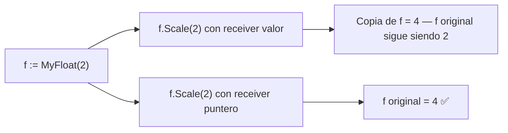
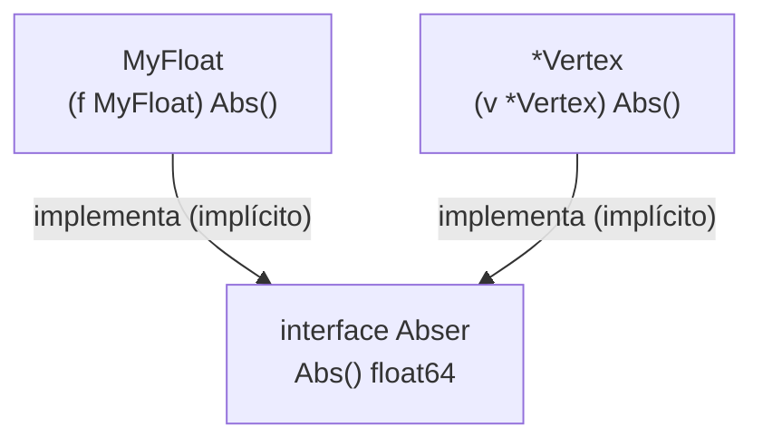

# Seminario de Lenguajes — Go — Clase 4

---

## Contexto de Conexión

Las clases anteriores cubrieron los tipos básicos de Go, variables, control de flujo, slices, maps y funciones. Esta clase introduce los mecanismos que Go usa para modelar datos y comportamiento de forma estructurada: punteros, tipos nombrados, métodos, structs y las interfaces —el corazón del polimorfismo en Go.

---

## Conceptos Core

- **Puntero (`*T`)**: almacena la dirección de memoria de un valor de tipo T. Zero value: `nil`.
- **`&`**: operador que obtiene la dirección de una variable.
- **`*`**: operador de desreferencia — accede al valor apuntado.
- **`new(T)`**: aloca memoria para un valor de tipo T y retorna un `*T` (apunta a un zero value).
- **Garbage Collector**: cuando un puntero deja de referenciar una zona de memoria, el GC la libera automáticamente.
- **Tipo nombrado (`type MyInt int`)**: crea un tipo nuevo con el mismo tipo subyacente. Es **incompatible** con el tipo original sin conversión explícita.
- **Casting `T(x)`**: conversión permitida si ambos tipos tienen el mismo tipo subyacente.
- **Método**: función con un argumento receiver. Permite asociar comportamiento a un tipo.
- **Receiver por valor**: el método recibe una copia — no puede modificar el original.
- **Receiver por puntero (`*T`)**: el método recibe la dirección — puede modificar el original.
- **Struct**: conjunto de campos de distintos tipos agrupados bajo un nombre.
- **Struct embedding**: incluir un tipo dentro de otro como campo anónimo, "heredando" sus campos y métodos con acceso directo.
- **Interface**: conjunto de firmas de métodos. Un tipo la implementa simplemente implementando todos sus métodos — sin declaración explícita (`implements` no existe en Go).
- **Par (value, type)**: representación interna de un valor de interface.
- **Empty interface (`interface{}`)**: no especifica métodos — puede contener cualquier tipo.
- **Type assertion `x.(T)`**: accede al valor concreto subyacente de una interface.
- **Type switch**: switch que discrimina por el tipo concreto de un valor interface.
- **Stringer**: interface del paquete `fmt` con el método `String() string`. Si un tipo la implementa, `fmt.Println` usa ese método automáticamente.

---

## Desarrollo

### 1. Punteros

```go
var p *int          // p es nil
i := 42
p = &i              // p apunta a i
fmt.Println(*p)     // 42  — desreferencia
*p = 100            // modifica i a través del puntero
fmt.Println(i)      // 100
```

**`new(T)`** aloca y retorna un puntero:

```go
p := new(int)   // *p == 0
q := new(int)
*p = 10
*q = 5
q = p           // q ahora apunta a lo mismo que p
                // el valor anterior de q queda sin referencias → GC lo libera
fmt.Println(*p, *q) // 10 10
```

**Parámetros siempre por valor** — incluso los punteros. Lo que cambia es el *contenido* al que apuntan:

```go
func zero(xPtr *int) { *xPtr = 0 }

func main() {
    x := 5
    zero(&x)
    fmt.Println(x) // 0  — x fue modificado a través del puntero
}
```

---

### 2. Declaración de Tipos y Casting

`type` crea un tipo nuevo **incompatible** con su tipo subyacente, aunque comparten los mismos valores y operaciones internas:

```go
type MyFloat float64
type MyFloat2 float64

var f float64 = 1.5
var mf MyFloat = 2.5

f = mf  // ❌ type mismatch
mf = MyFloat(f)  // ✅ conversión explícita
```

Una conversión `T(x)` es válida si origen y destino tienen el **mismo tipo subyacente**:

```go
type Celsius float64
type Fahrenheit float64

func CToF(c Celsius) Fahrenheit {
    return Fahrenheit(c * 9 / 5 + 32)
}
```

---

### 3. Métodos

Go no tiene clases, pero permite definir métodos sobre tipos nombrados. Un método es una función con un argumento **receiver**:

```go
type Celsius float64

func (c Celsius) String() string {
    return fmt.Sprintf("%g°C", c)
}

var c Celsius = 35.0
fmt.Println(c.String()) // 35°C
fmt.Println(c)          // 35°C  — fmt usa String() automáticamente
```

#### Receiver por valor vs. por puntero

| | Receiver por valor `(f MyFloat)` | Receiver por puntero `(f *MyFloat)` |
|---|---|---|
| ¿Puede modificar el receiver? | ❌ No (opera sobre copia) | ✅ Sí (opera sobre el original) |
| Equivalente a | función con parámetro por valor | función con parámetro por puntero |

```go
// NO modifica el original
func (f MyFloat) Scale(s float64) { f = f * MyFloat(s) }

// SÍ modifica el original
func (f *MyFloat) Scale(s float64) { *f = *f * MyFloat(s) }
```

Go permite llamar a un método con receiver puntero directamente sobre un valor:

```go
f := MyFloat(math.Sqrt2)
f.Scale(2)       // equivale a (&f).Scale(2) — Go lo hace automáticamente
```

El receiver puede ser `nil` — el método debe manejarlo:

```go
func (mv *MySlice) Add() (res int) {
    if *mv == nil { return 0 }
    for _, e := range *mv { res += e }
    return
}
```

---

### 4. Structs

Agrupa campos de distintos tipos bajo un nombre:

```go
type Person struct {
    firstname string
    lastname  string
    age       int
}

p1 := Person{"Pepe", "Sargento", 25}        // por posición
p2 := Person{lastname: "Larralde", firstname: "José"}  // por nombre
p3 := new(Person)                            // puntero a Person zero value
```

Los structs se pasan **por copia** a las funciones. Para modificar el original, usar puntero. La notación punto funciona igual para valores y punteros:

```go
p3 = &p1
p3.age = 28       // modifica p1 (notación punto automática en punteros)
fmt.Println(p1)   // {Pepe Sargento 28}
```

Los structs son **comparables** si todos sus campos lo son — y los comparables pueden usarse como clave de maps:

```go
type address struct { hostname string; port int }
hits := make(map[address]int)
hits[address{"golang.org", 443}]++
```

---

### 5. Struct Embedding

En lugar de repetir campos comunes en varios structs, se puede **embedear** un tipo como campo anónimo:

```go
// Sin embedding — acceso verboso
type Circle struct { Center Point; Radius int }
c.Circle.Center.X = 1

// Con embedding — campo anónimo
type Circle struct {
    Point       // campo anónimo: el nombre del tipo ES el nombre del campo
    Radius int
}
c.Point.X = 1   // acceso completo
c.X = 2         // acceso directo — Go "promociona" los campos
```

Se pueden anidar varios niveles:

```go
type Cylinder struct {
    Circle        // embedding de Circle (que ya embebe Point)
    Height int
}
var cy Cylinder
cy.Circle.Point.X = 1  // acceso completo
cy.Circle.X = 2         // acceso parcial
cy.X = 3                // acceso directo
```

---

### 6. Interfaces

Una interface define un conjunto de firmas de métodos. Un tipo la **implementa automáticamente** si tiene todos esos métodos — sin `implements`:

```go
type Abser interface {
    Abs() float64
}

type MyFloat float64
func (f MyFloat) Abs() float64 { ... }  // MyFloat implementa Abser

type Vertex struct { X, Y float64 }
func (v *Vertex) Abs() float64 { ... }  // *Vertex implementa Abser (no Vertex)

var a Abser
a = MyFloat(123.45)    // ✅
a = &Vertex{3, 4}      // ✅
a = Vertex{3, 4}       // ❌ Vertex no implementa Abser, *Vertex sí
```

#### Par (value, type)

Un valor de interface internamente es el par `(valor_concreto, tipo_concreto)`:

```go
func describe(i I) {
    fmt.Printf("(%v, %T)\n", i, i)
}

var i I           // (<nil>, <nil>)
var t *T
i = t             // (<nil>, *main.T)  — tiene tipo pero valor nil
i.M()             // ejecuta M() de *T — el método debe manejar nil

i = &T{"hello"}   // (&{hello}, *main.T)
```

> Un interface `nil` (sin tipo ni valor) causa runtime error al invocar métodos. Un interface con tipo concreto pero valor `nil` puede funcionar si el método lo maneja.

#### Empty interface

```go
var i interface{}
i = 42
i = "hello"
i = Point{1, 2}
// acepta cualquier tipo
```

Usado en `fmt.Println`, `fmt.Printf`, etc.

#### Type assertion

```go
var i interface{} = "hello"

s := i.(string)           // si falla → runtime panic
s, ok := i.(string)       // forma segura: ok=true, s="hello"
f, ok := i.(float64)      // ok=false, f=0.0 — sin panic
```

#### Type switch

```go
func do(i interface{}) {
    switch v := i.(type) {
    case nil:    fmt.Printf("Nil: %v\n", v)
    case int:    fmt.Printf("Twice %v is %v\n", v, v*2)
    case string: fmt.Printf("%q is %v bytes long\n", v, len(v))
    default:     fmt.Printf("I don't know about type %T!\n", v)
    }
}
```

#### Stringer

Si un tipo implementa `String() string`, `fmt` lo usa automáticamente:

```go
type Person struct { Name string; Age int }

func (p Person) String() string {
    return fmt.Sprintf("%v (%v years)", p.Name, p.Age)
}

fmt.Println(Person{"Arthur Dent", 42}) // Arthur Dent (42 years)
```

---

## Visualización

### Receiver por valor vs. puntero



### Implementación implícita de interfaces



---

## Lo que no podés ignorar

> 1. **`*T` es el tipo puntero, `*x` es la desreferencia**: son notaciones distintas según el contexto — una en declaración de tipo, otra en expresión.
> 2. **Tipos nombrados son incompatibles entre sí**: `MyFloat` y `float64` no son el mismo tipo aunque compartan estructura — siempre necesitás conversión explícita.
> 3. **Receiver por puntero para modificar**: si el método necesita modificar el receiver, usá `*T`. Si usás receiver por valor, operás sobre una copia y los cambios se pierden.
> 4. **`*Vertex` implementa la interface, `Vertex` no**: si el método tiene receiver puntero, solo el puntero satisface la interface. Error clásico y silencioso.
> 5. **Embedding no es herencia**: Go no tiene herencia. El embedding solo "promociona" campos y métodos para acceso directo, pero no hay relación is-a entre los tipos.
> 6. **Interface nil vs. interface con tipo concreto nil**: son distintos. Un interface `nil` puro causa panic al invocar métodos. Uno con tipo concreto (`*T`) pero valor nil puede ejecutar métodos si están preparados para ello.
