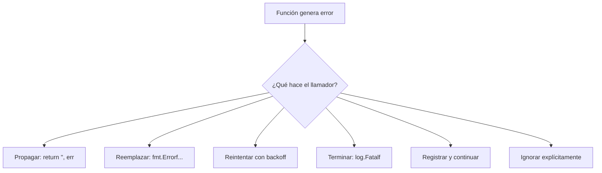
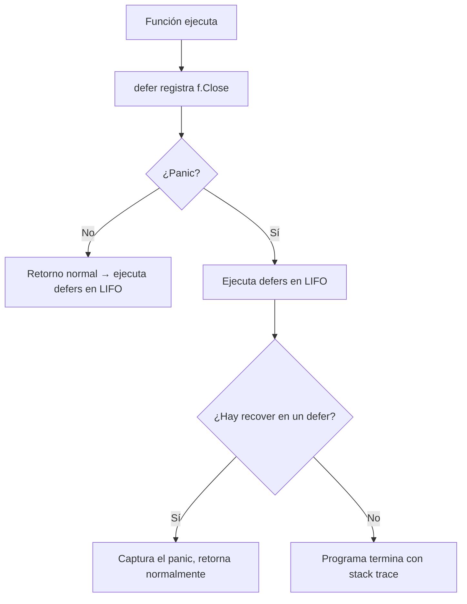

# Seminario de Lenguajes — Go — Clase 5

---

## Contexto de Conexión

En la clase 4 vimos cómo Go modela datos y comportamiento con structs, métodos e interfaces. Esta clase aborda cómo Go maneja situaciones que pueden salir mal: el sistema de errores, y luego profundiza en características avanzadas de las funciones: funciones como valores, funciones anónimas, closures, funciones variádicas, llamadas diferidas y el mecanismo de pánico y recuperación.

---

## Conceptos Core

- **`error`**: interface built-in con un único método `Error() string`. El patrón estándar de Go para indicar que algo salió mal.
- **Propagación del error**: retornar el error recibido hacia el llamador, sin modificarlo.
- **Reemplazo del error**: crear un nuevo error con `fmt.Errorf` que reemplaza el original con un mensaje más específico o de más alto nivel.
- **`fmt.Errorf`**: formatea un string y devuelve un nuevo `error`.
- **`errors.New`**: crea un error simple a partir de un string.
- **Function value**: en Go, las funciones son valores de primer orden — pueden asignarse a variables, pasarse como parámetros y retornarse.
- **Función anónima**: función sin nombre, definida en el lugar donde se usa. Permite crear closures.
- **Closure**: función anónima que "captura" variables del entorno donde fue creada. Esas variables persisten entre llamadas.
- **Función variádica**: función que acepta una cantidad variable de argumentos del mismo tipo, declarada con `...T`.
- **`defer`**: pospone la ejecución de una llamada a función hasta que la función contenedora retorne. Se usa típicamente para limpieza de recursos.
- **`panic`**: señal de error grave en tiempo de ejecución (o generada explícitamente). Detiene la ejecución normal y ejecuta las funciones diferidas.
- **`recover`**: dentro de una función diferida, captura el valor del panic y permite que el programa continúe.

---

## Desarrollo

### 1. Manejo de Errores

En Go no hay excepciones. El error es un valor que se retorna junto al resultado de la función. El **llamador** es responsable de chequearlo.

```go
type error interface {
    Error() string
}
```

**Patrón básico:**

```go
i, err := strconv.Atoi("42a")
if err != nil {
    fmt.Printf("Error: %v\n", err)
    return
}
fmt.Println("Entero:", i)
```

Para errores con una única causa posible se puede usar el patrón `value, ok`:

```go
value, ok := cache.Lookup(key)
if !ok {
    // key no existe
}
```

---

### 2. Estrategias de Manejo de Errores

#### 1. Propagar el error (retornarlo sin modificar)

```go
func AddStr(s1, s2 string) (string, error) {
    i1, err := strconv.Atoi(s1)
    if err != nil {
        return "", err   // propaga el error original
    }
    i2, err := strconv.Atoi(s2)
    if err != nil {
        return "", err
    }
    return strconv.Itoa(i1 + i2), nil
}
// Salida: strconv.Atoi: parsing "28a": invalid syntax
```

#### 2. Reemplazar el error (agregar contexto)

```go
func AddStr(s1, s2 string) (string, error) {
    i1, err := strconv.Atoi(s1)
    if err != nil {
        return "", fmt.Errorf("convirtiendo %s", s1)  // nuevo error con contexto
    }
    ...
}
// Salida: convirtiendo 28a
```

#### 3. Reintentar la operación

```go
func WaitForServer(url string) error {
    const timeout = 1 * time.Minute
    deadline := time.Now().Add(timeout)
    for tries := 0; time.Now().Before(deadline); tries++ {
        _, err := http.Head(url)
        if err == nil { return nil }
        log.Printf("server not responding (%s); retrying...", err)
        time.Sleep(time.Second << uint(tries))  // backoff exponencial
    }
    return fmt.Errorf("server %s failed to respond after %s", url, timeout)
}
```

#### 4. Terminación controlada (cuando no hay recuperación posible)

```go
if err := WaitForServer(url); err != nil {
    log.Fatalf("Site is down: %v\n", err)  // imprime y llama os.Exit(1)
}
```

#### 5. Registrar y continuar

```go
if err := Ping(); err != nil {
    log.Printf("ping failed: %v; networking disabled", err)
}
```

#### 6. Ignorar el error explícitamente

```go
content, err := os.ReadFile("data.json")
if err != nil {
    content = []byte("datos por defecto")
}
```

---

### 3. Package `errors`

Internamente, `errors.New` crea un struct privado que implementa la interface `error`:

```go
// package errors
func New(text string) error { return &errorString{text} }
type errorString struct { text string }
func (e *errorString) Error() string { return e.text }

// package fmt
func Errorf(format string, args ...interface{}) error {
    return errors.New(Sprintf(format, args...))
}
```

---

### 4. Function Values

En Go, las funciones son valores de primera clase — tienen tipo, se pueden asignar y pasar:

```go
func square(n int) int   { return n * n }
func negative(n int) int { return -n }

f := square
fmt.Println(f(3))         // 9

f = negative
fmt.Println(f(3))         // -3
fmt.Printf("%T\n", f)    // func(int) int

// f = product  ❌ error: tipos incompatibles (int,int)→int vs int→int
```

El zero value de un tipo función es `nil`:

```go
var f func(int) int
if f != nil {
    f(3)
}
// f(3) directamente → runtime error: call of nil function
```

Pasando funciones como parámetros:

```go
func forEachNode(n *Node, pre, post func(n *Node)) {
    if pre != nil { pre(n) }
    for c := n.FirstChild; c != nil; c = c.NextSibling {
        forEachNode(c, pre, post)
    }
    if post != nil { post(n) }
}
```

---

### 5. Anonymous Functions y Closures

Una función anónima es una función sin nombre definida en el lugar de uso:

```go
s := strings.Map(func(r rune) rune { return r + 1 }, "HAL-9000")
// "IBM.:111"
```

Una función anónima que **captura variables del entorno** es un **closure**. Las variables capturadas persisten entre llamadas:

```go
func squares() func() int {
    var x int                // x es capturada por la función anónima
    return func() int {
        x++
        return x * x
    }
}

f := squares()
fmt.Println(f()) // 1  (x=1)
fmt.Println(f()) // 4  (x=2)
fmt.Println(f()) // 9  (x=3)
fmt.Println(f()) // 16 (x=4)
```

> Cada llamada a `squares()` crea una **nueva** variable `x` independiente. Dos llamadas distintas a `squares()` generan dos closures con su propio `x`.

---

### 6. Variadic Functions

Acepta una cantidad variable de argumentos del mismo tipo:

```go
func sum(vals ...int) int {
    total := 0
    for _, val := range vals {
        total += val
    }
    return total
}

fmt.Println(sum())           // 0
fmt.Println(sum(3))          // 3
fmt.Println(sum(1, 2, 3, 4)) // 10

values := []int{1, 2, 3, 4}
fmt.Println(sum(values...))  // 10 — "expande" el slice
```

Dentro de la función, `vals` es un slice. El `...` al llamar expande un slice existente.

---

### 7. Deferred Function Calls

`defer` pospone la ejecución de una llamada hasta que la función que lo contiene retorne. Ideal para limpieza de recursos:

```go
func ReadFile(name string) ([]byte, error) {
    f, err := Open(name)
    if err != nil { return nil, err }
    defer f.Close()   // se ejecuta cuando ReadFile retorne, sin importar cómo
    // ... leer el archivo ...
}
```

> Las llamadas diferidas se ejecutan en orden **LIFO** (la última en diferirse es la primera en ejecutarse).

---

### 8. Panic

`panic` interrumpe la ejecución normal del programa. Puede ser generado por el runtime (división por cero, índice fuera de rango, nil pointer) o por el programa:

```go
func Reset(x *Buffer) {
    if x == nil {
        panic("x is nil")
    }
    x.elements = nil
}
```

Cuando ocurre un panic:
1. La ejecución normal se detiene.
2. Se ejecutan todas las funciones diferidas (en LIFO).
3. El programa termina mostrando el stack trace y el valor del panic.

```
panic: runtime error: integer divide by zero
main.f(0x0) ...
main.f(0x1) ...
exit status 2
```

> Usar `panic` solo para errores **inesperados**. Para errores esperables (entrada inválida, archivo no encontrado), usar `error`.

---

### 9. Recover

Dentro de una función **diferida**, `recover` captura el valor del panic y permite recuperar la ejecución:

```go
func Parse(input string) (s *Syntax, err error) {
    defer func() {
        if p := recover(); p != nil {
            err = fmt.Errorf("internal error: %v", p)
        }
    }()
    // ... parser que puede entrar en panic ...
}
```

- Si hubo panic: `recover()` retorna el valor pasado a `panic` y finaliza el estado de pánico. La función que entró en pánico no continúa, pero retorna "normalmente".
- Si no hubo panic: `recover()` retorna `nil` y no tiene efecto.
- Fuera de una función diferida: `recover()` siempre retorna `nil`.

---

## Visualización

### Ciclo de vida de un error en Go



### defer + panic + recover



---

## Lo que no podés ignorar

> 1. **Siempre chequear `err != nil` inmediatamente**: el patrón de Go es `val, err := ...; if err != nil { ... }`. No diferir el chequeo.
> 2. **`fmt.Errorf` crea un error nuevo**: no "envuelve" el original de forma que se pueda desempaquetar (eso requiere `%w` en Go 1.13+). Propagar vs. reemplazar son decisiones de diseño.
> 3. **Las funciones son valores**: podés asignarlas, pasarlas y retornarlas como cualquier `int` o `string`. El tipo incluye la firma completa.
> 4. **Closures capturan la variable, no el valor**: si una variable capturada cambia después de crear el closure, el closure verá el nuevo valor. Clásico problema en loops.
> 5. **`defer` se evalúa en el momento de la llamada, no de la ejecución**: los argumentos del `defer` se evalúan cuando se llama al `defer`, no cuando se ejecuta la función diferida.
> 6. **`panic` para lo inesperado, `error` para lo esperable**: división por cero, acceso a nil = panic. Archivo no encontrado, formato inválido = error.
> 7. **`recover` solo funciona dentro de un `defer`**: si lo llamás en cualquier otro lugar retorna `nil` sin efecto. Patrón clásico: `defer func() { if p := recover(); p != nil { ... } }()`.
